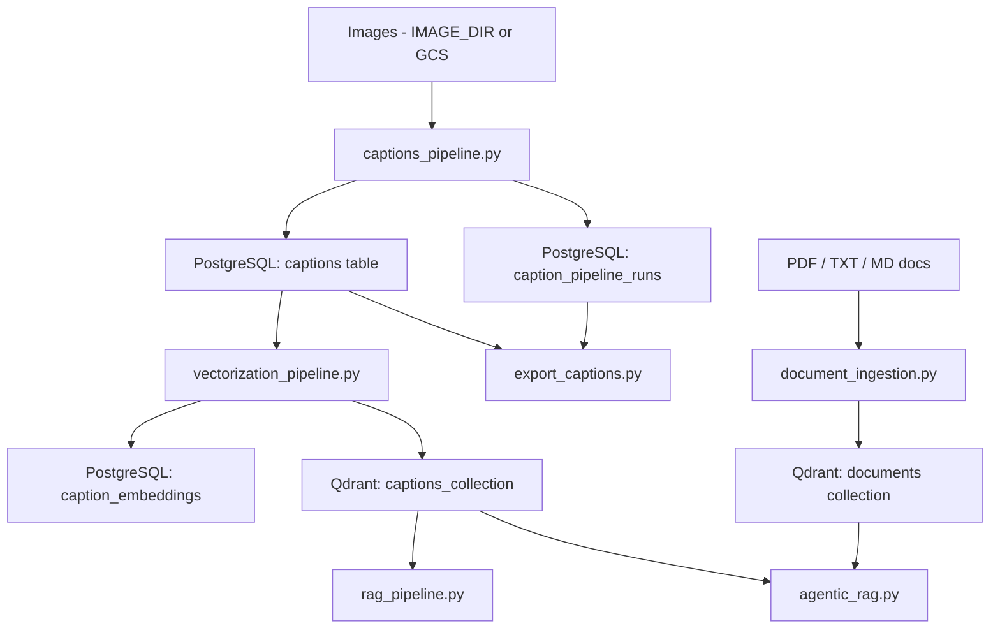

## Architecture and data flow

This document gives a high‑level view of how data moves through the system:
from images, to captions, to embeddings, to question‑answering and exports.

### Main components

- **Caption generation**
  - Entry: `[src/mllm/main/captions_pipeline.py](src/mllm/main/captions_pipeline.py)`
  - Core logic: `[src/mllm/captions_generate.py](src/mllm/captions_generate.py)`
  - Output: PostgreSQL tables `caption_pipeline_runs` and `captions`
- **Vectorization (captions → Qdrant)**
  - Entry: `[src/mllm/main/vectorization_pipeline.py](src/mllm/main/vectorization_pipeline.py)`
  - DB ops: `[src/database_pipeline/database_operations.py](src/database_pipeline/database_operations.py)`
  - Qdrant ops: `[src/database_pipeline/vector_db_operations.py](src/database_pipeline/vector_db_operations.py)`
  - Output: Qdrant collection `captions_collection` + `caption_embeddings` table
- **RAG over captions**
  - Entry: `[src/rag/rag_pipeline.py](src/rag/rag_pipeline.py)`
  - Uses: Qdrant `captions_collection` + DeepSeek API
- **Agentic RAG (captions + documents)**
  - Entry: `[src/rag/agentic_rag.py](src/rag/agentic_rag.py)`
  - Uses: Qdrant `captions_collection` + `documents` collection
- **Document ingestion**
  - Entry: `[src/rag/document_ingestion.py](src/rag/document_ingestion.py)`
  - Output: Qdrant collection `documents` (hierarchical nodes)
- **Export and maintenance**
  - Export captions: `[src/mllm/export_captions.py](src/mllm/export_captions.py)`
  - Reset captions embeddings/collection:
    `[src/database_pipeline/delete_captions.py](src/database_pipeline/delete_captions.py)`

### Data flow diagram

### Typical lifecycle

1. **Prepare environment**
   - Clone repo, create virtualenv, install dependencies
   - Configure `.env` and services (Postgres, Qdrant)  
     → see `[docs/setup_and_env.md](docs/setup_and_env.md)`
   - All project data uses a single root: `data/` (metadata in `data/metadata/`, exported captions in `data/frontend_captions/`, etc.).

2. **Generate captions**
   - Run `python -m mllm.main.captions_pipeline`
   - Images from `IMAGE_DIR` → `captions` table, with a new `run_id`

3. **Embed captions into Qdrant**
   - Run `python -m mllm.main.vectorization_pipeline`
   - Accepted captions → Qdrant `captions_collection`, tracking in `caption_embeddings`

4. **(Optional) Ingest documents**
   - Run `python -m rag.document_ingestion ...`
   - PDFs / text files → Qdrant `documents` collection

5. **Question answering / analysis**
   - Caption‑only RAG:
     - `python -m rag.rag_pipeline`
   - Agentic RAG (captions + documents):
     - `python -m rag.agentic_rag`

6. **Export and maintenance**
   - Export captions for a specific run:
     - `python -m mllm.export_captions --list-runs`
     - `python -m mllm.export_captions <run_id>`
   - Reset caption embeddings and Qdrant captions collection:
     - `python -m database_pipeline.delete_captions`

### Where to look when modifying the system

- **Changing how images are mapped to mines / metadata**  
  - `src/eo/mllm_helper.py` (metadata lookup and prompt construction)
- **Changing satellite image processing or OpenEO operations**  
  - `src/eo/prepare_openeo.py` (OpenEO image preparation)
  - `src/eo/utilities.py` (satellite image utilities)
- **Changing how captions are generated or evaluated**  
  - `src/mllm/captions_generate.py` (LLaMA prompt & evaluation loop)  
  - `src/mllm/evaluation.py` (Gemini / Anthropic judge)
- **Adding or changing prompt versions**  
  - Drop a new `prompts_v<N>.py` file into `src/mllm/prompts/` and set `PROMPT_VERSION` accordingly.
    The router in `src/mllm/prompts/__init__.py` auto-discovers all `prompts_v*.py` files.
- **Changing vector store details (distance metric, payload structure)**  
  - `src/database_pipeline/vector_db_operations.py` (collection creation, upserts, deletions)
  - `src/mllm/qdrant_keepalive.py` (Qdrant connection keep-alive utility)
- **Changing RAG behaviour or LLM prompts**  
  - `src/rag/rag_pipeline.py` and `src/rag/agentic_rag.py`

For concrete command examples and “how-to” steps, see
`[docs/pipelines_guide.md](docs/pipelines_guide.md)` and
`[docs/export_and_maintenance.md](docs/export_and_maintenance.md)`.

